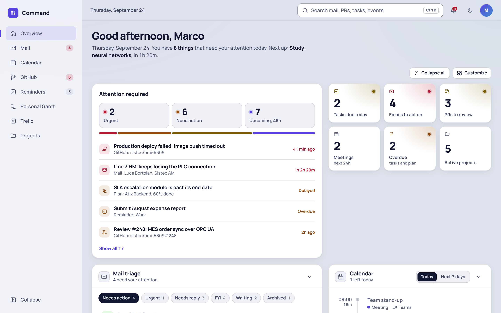
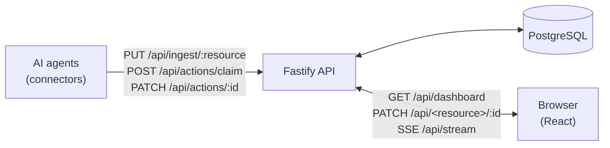

# Command

A personal dashboard fed by **AI agents**. The agents read your sources (mail, calendar, GitHub,
Trello, company planning…) and write the data to the server through a REST API; the browser shows
it all on a single board and sends your actions back to the sources (mark as done, move a card,
ack a PR…).

<picture>
  <source media="(prefers-color-scheme: dark)" srcset="docs/dashboard-dark.png">
  
</picture>

- **Widgets**: attention (what needs you right now), KPIs, mail, calendar, GitHub (PRs and
  issues), reminders, Trello Kanban, company Gantt, projects.
- **Live**: every write reaches the browser over SSE, no reload needed.
- **Reversible actions**: optimistic updates with Undo; changes go into a queue (`actions`) that
  the source's agent applies to the real system.
- **Per-user preferences**: board layout, hidden or collapsed widgets and the sidebar are saved on
  the server and follow the user across devices.
- Light/dark theme, desktop and mobile layouts.

`demo.html` is the reference prototype for UX and domain rules.

## How it works



1. The agent sends records with `PUT /api/ingest/:resource` (upsert by `externalId`).
2. The browser reads the snapshot from `GET /api/dashboard` and computes priorities, KPIs and
   project status locally.
3. A user action (`PATCH /api/<resource>/:id`) updates the record immediately and queues a row in
   `actions`.
4. The agent claims the actions (`POST /api/actions/claim`), applies them to the source and reports
   the outcome (`PATCH /api/actions/:id`).

## Quick start (Docker)

Requires Docker. The whole stack (PostgreSQL, API, web) starts with compose:

```bash
cp .env.example .env
# set JWT_SECRET (at least 32 characters):
#   node -e "console.log(crypto.randomBytes(48).toString('base64url'))"
# and check TZ, USER_NAME, USER_GITHUB

docker compose up -d --build
docker compose exec server node dist/scripts/seed.js                       # demo data (optional)
docker compose exec server node dist/scripts/user.js you@example.com --name "Full Name"
```

Open <http://localhost:8080> and sign in. Migrations are applied when the server starts.

| Service | Port | Notes |
|---|---|---|
| `web` | 8080 | nginx: serves the frontend and proxies `/api` (same origin, required for the refresh cookie) |
| `server` | 3000 | Fastify API, where agents connect |
| `db` | 5432 | PostgreSQL 16, `pgdata` volume |

In production, behind HTTPS, set `COOKIE_SECURE=true`.

## Connecting an agent

Create an agent and its token (shown once; only its hash is stored in the DB):

```bash
docker compose exec server node dist/scripts/agent-token.js github pulls,issues
# no resources = all of them; --rotate issues a new token for an existing agent
```

Resources: `emails`, `events`, `pulls`, `issues`, `reminders`, `tasks`, `projects`, `gantt`.
An agent can only write to the resources in its scope.

A typical cycle:

```bash
API=http://localhost:3000/api
AUTH="Authorization: Bearer cmd_agent_..."

# 1. open a run (optional, tracks outcome and stats)
curl -X POST $API/agents/runs -H "$AUTH" -H 'content-type: application/json' \
  -d '{ "resource": "reminders" }'

# 2. send the data; "replace" deletes this agent's records that are no longer present
curl -X PUT $API/ingest/reminders -H "$AUTH" -H 'content-type: application/json' -d '{
  "runId": "<run id>",
  "mode": "replace",
  "items": [
    { "externalId": "todo:42", "title": "Renew certificate", "due": "2026-09-30T09:00:00+02:00", "priority": "high" }
  ]
}'

# 3. apply the user's actions to the source
curl -X POST $API/actions/claim -H "$AUTH" -H 'content-type: application/json' \
  -d '{ "resource": "reminders", "limit": 10 }'
curl -X PATCH $API/actions/<id> -H "$AUTH" -H 'content-type: application/json' \
  -d '{ "status": "done" }'

# 4. close the run
curl -X PATCH $API/agents/runs/<id> -H "$AUTH" -H 'content-type: application/json' \
  -d '{ "status": "success", "summary": "1 reminder synced" }'
```

Good to know:

- Dates are always ISO 8601 with an offset.
- Record shapes are defined by the zod schemas in `packages/shared/src/schemas`
  (`*Input` for ingest, `*Patch` for the fields the user can edit).
- Fields with a user action still in the queue are not overwritten by ingest: the response lists
  them in `protectedFields`.
- A claimed action that is not completed within 10 minutes becomes available again.

The full endpoint list is in [CLAUDE.md](CLAUDE.md#api-prefisso-api) (in Italian).

## Development

Requirements: Node.js 22+, Docker for PostgreSQL.

```bash
npm install
cp .env.example .env
docker compose up -d db              # database only
npm run db:migrate
npm run db:seed                      # demo data
npm run user:create -- you@example.com --name "Full Name"
npm run dev                          # API on :3000 (watch) + web on :5173 (proxies /api)
```

| Command | |
|---|---|
| `npm run dev:api` · `npm run dev:web` | start only one of the two apps |
| `npm test` | unit tests (shared), API integration on PGlite (no Docker), frontend on jsdom |
| `npm run typecheck` | type check across all workspaces |
| `npm run build` | build server and web |
| `npm run db:generate` | generate a migration after changing `apps/server/src/db/schema` |
| `npm run user:reset -- <email>` | set a new password, sign out all sessions |
| `npm run agent:token -- <name> [resources]` | create an agent and print its token |

### Layout

```
packages/shared   @command/shared  zod schemas (the single contract) and pure domain logic
apps/server       @command/server  Fastify 5, Drizzle, PostgreSQL, JWT auth, SSE
apps/web          @command/web     React 19, Vite, Tailwind v4, TanStack Query
demo.html                          reference prototype, do not edit
```

Architecture, conventions and the checklist for adding a resource are in [CLAUDE.md](CLAUDE.md)
(in Italian).

## Configuration

Main `.env` variables (see `.env.example`):

| Variable | Description |
|---|---|
| `JWT_SECRET` | secret used to sign user tokens, required |
| `DATABASE_URL` | PostgreSQL connection |
| `TZ` | the owner's time zone: defines "today" and "overdue" |
| `USER_NAME`, `USER_ROLE`, `USER_GITHUB` | dashboard owner, also used to filter the company Gantt |
| `CORS_ORIGIN` | frontend origin in development |
| `ACCESS_TOKEN_TTL_SECONDS`, `REFRESH_TOKEN_TTL_DAYS` | lifetime of the access token (15 min) and refresh token (7 days) |
| `LOGIN_RATE_LIMIT` | login attempts allowed per window |
| `COOKIE_SECURE` | `true` behind HTTPS |

## Security

- Users: scrypt-hashed passwords, a short-lived JWT access token kept in memory, a refresh token
  in an httpOnly cookie rotated on every use. Reusing an already rotated refresh token revokes all
  sessions.
- Agents: separate tokens scoped per resource; an agent token does not work as a user token and
  vice versa.
- Rate-limited login, with the same response for an unknown email and a wrong password.
